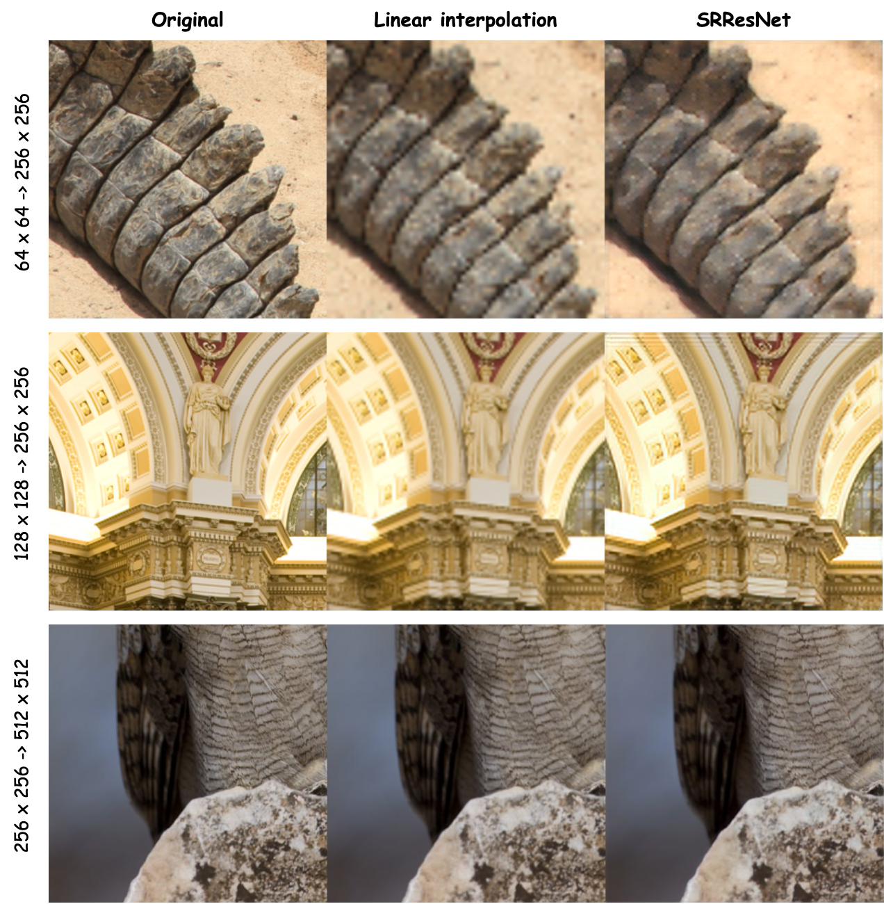

:fire: In this repository we reproduce the SRResNet model [arxiv.org/abs/1609.04802](https://arxiv.org/abs/1609.04802).

Our results:


SRResNet definetely beats linear interpolation in quality (but the fps is still under question, linear interpolation is faster by two orders).
Great work! :sparkles:

:chart_with_upwards_trend: **Train**
```bash
python train.py --low_res=128 --high_res=256 --train_data_path=path/to/train/data --val_data_path=path/to/val/data --exp_name{optionally}=exp_name
```
_exp_name_ is used to name saved weights and initialize wandb experiment name.

:top: **Evaluate**
```bash
python train.py --low_res=128 --high_res=256 --val_data_path=path/to/val/data --ckpt_path=path/to/checkpoint
```
